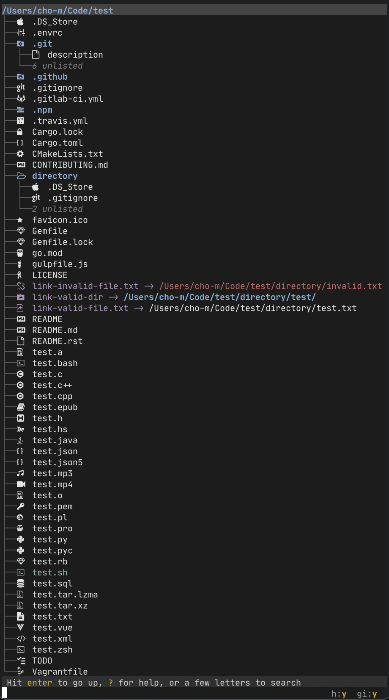

Nerd Fonts Icons
================

Requirements
------------
[Nerd Fonts](https://github.com/ryanoasis/nerd-fonts) installed either through a patched font or available as a fallback font.

Configuration
-------------
In broot config file, set
```
icon_theme: nerdfont
```

Limitations
-----------
These icons are limited by availability of symbols in Nerd Fonts, so this feature can only support a subset of filetypes available in `vscode` theme.

Example
-------

